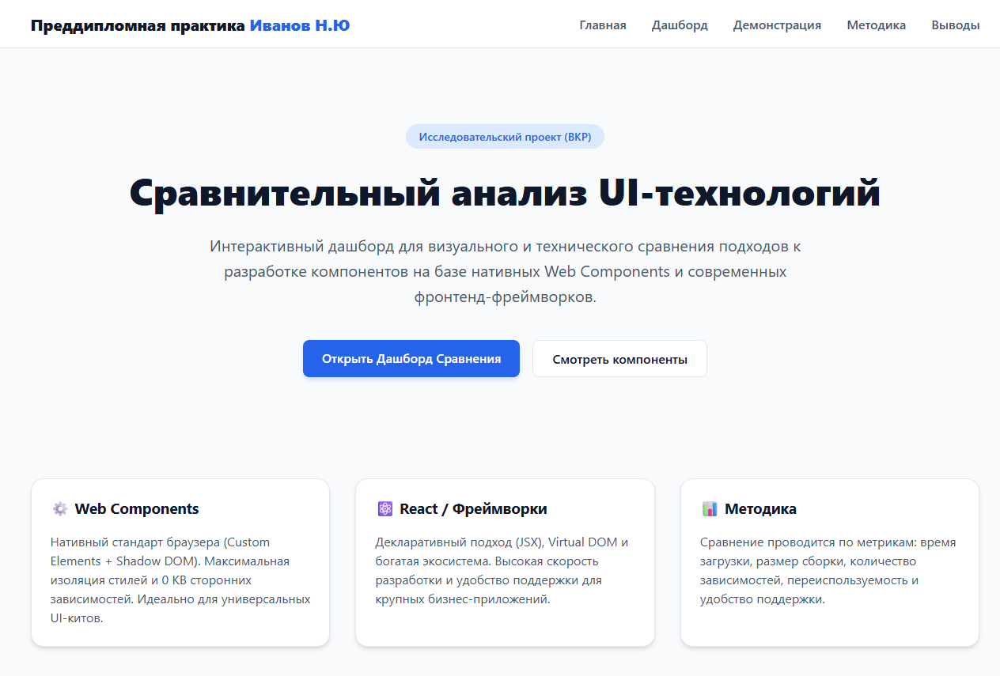
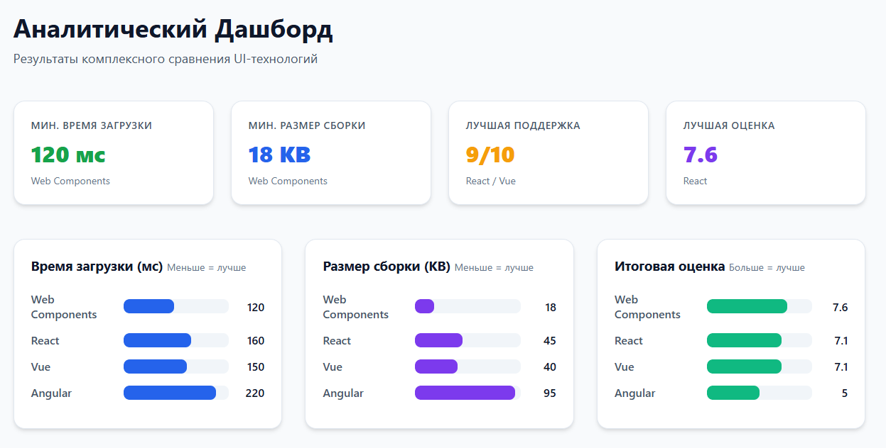
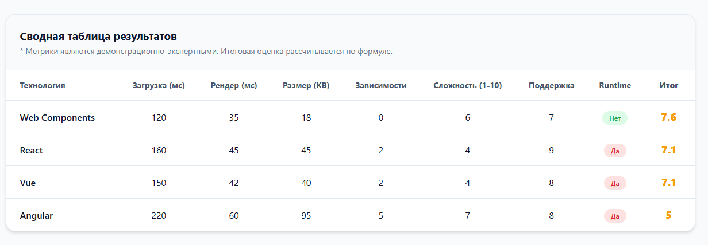
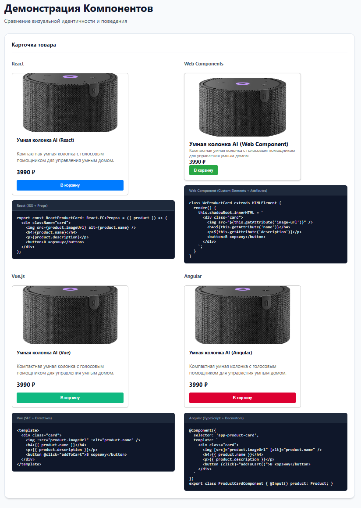
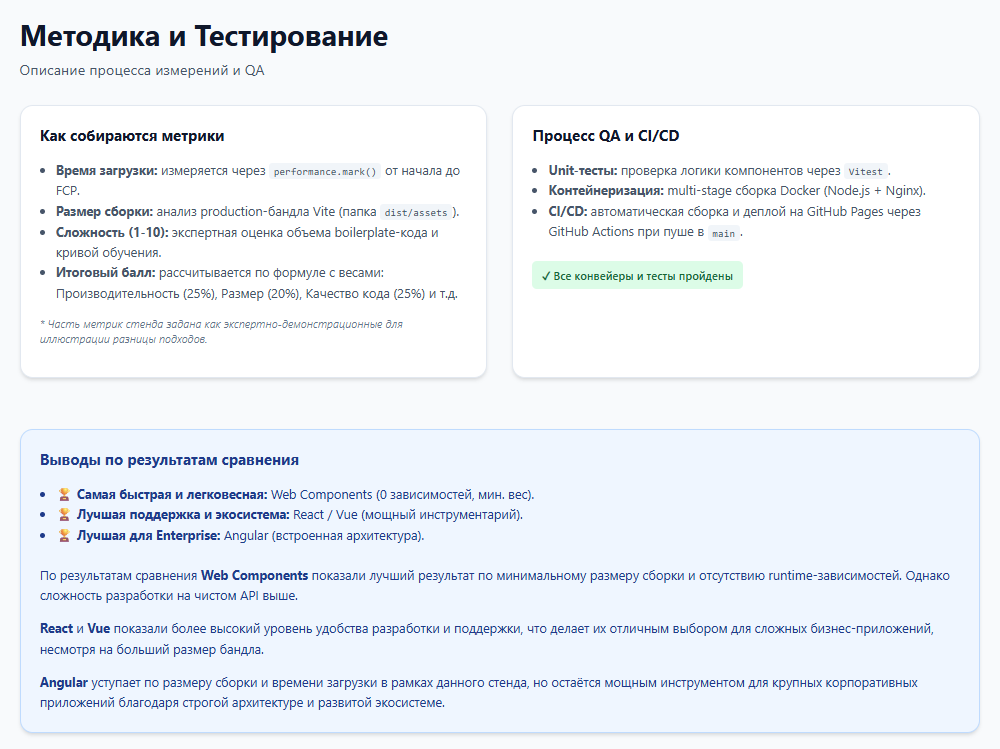
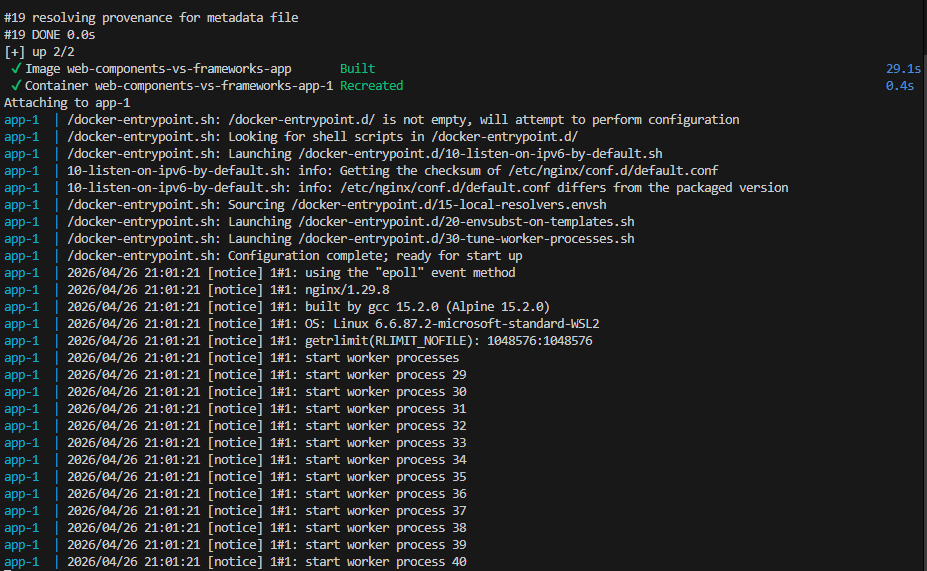
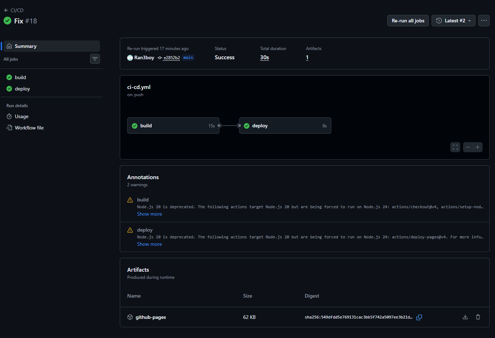

# Сравнение Web Components и Фронтенд-фреймворков

## Тема ВКР
«Сравнительный анализ технологии Web Components и современных фронтенд-фреймворков для разработки пользовательских интерфейсов»

## Цель проекта
Создать интерактивный демонстрационный стенд, позволяющий визуально и технически сравнить подходы к разработке UI-компонентов с использованием нативных Web Components и современных фронтенд-фреймворков (React, Vue, Angular).

## Используемые технологии
- **Frontend:** Vite, React, Vue.js (демо), Angular (демо), TypeScript, Web Components (Custom Elements, Shadow DOM), CSS.
- **Тестирование:** Vitest.
- **DevOps & Развертывание:** Docker, Docker Compose, GitHub Actions (CI/CD), Nginx.

## Структура проекта
- `/src/components/react/` — реализация базовых компонентов на React.
- `/src/components/web-components/` — реализация компонентов на нативных Web Components.
- `/src/pages/Compare.tsx` — интеграция компонентов, дашборд с метриками и демонстрация всех 4-х подходов.
- `/docs/` — документация для ВКР.
- `Dockerfile` и `docker-compose.yml` — конфигурация контейнеризации.
- `.github/workflows/` — конвейер CI/CD.

## Запуск проекта

### Локальный запуск (Node.js)
1. Установите зависимости: `npm install`
2. Запустите сервер разработки: `npm run dev`
3. Откройте в браузере локальную ссылку (обычно `http://localhost:5173`)

### Запуск через Docker
Убедитесь, что Docker запущен, и выполните:
```bash
docker compose up --build
```
Приложение будет доступно по адресу `http://localhost:8080`

### Запуск тестов
```bash
npm test
```

## CI/CD Pipeline
Проект настроен на автоматизированную проверку и развертывание с помощью GitHub Actions. При каждом пуше в ветку `main`:
1. Разворачивается окружение Node.js.
2. Устанавливаются зависимости и прогоняются тесты.
3. Проект собирается (`npm run build`).
4. Артефакты публикуются на GitHub Pages.

## Скриншоты для отчета
**1. Главная страница приложения с темой ВКР**  


**2. Аналитический дашборд с метриками**  


**3. Сводная таблица результатов**  


**4. Демонстрация компонентов Web Components, React, Vue, Angular**  


**5. Блок методики и выводов**  


**6. Успешная сборка Docker-образа**  


**7. Успешный CI/CD pipeline GitHub Actions**  

